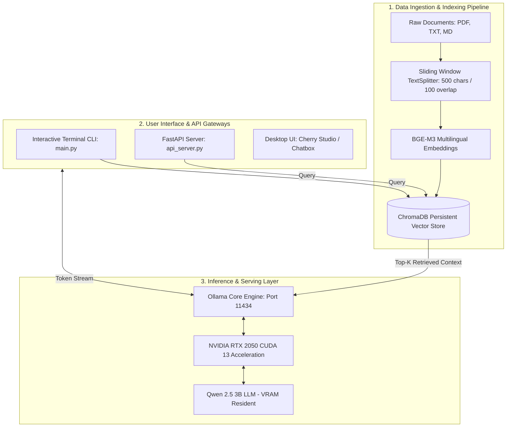

# High-Performance Offline Vietnamese Local LLM & RAG Engine

<div align="center">

[](https://python.org)
[](https://ollama.com)
[](https://developer.nvidia.com/cuda-toolkit)
[](https://fastapi.tiangolo.com)
[](https://trychroma.com)
[](LICENSE)

**A production-ready, 100% offline, privacy-first Retrieval-Augmented Generation (RAG) and Local LLM inference framework optimized for consumer-grade GPUs (4GB VRAM).**

[Tiếng Việt](#-hướng-dẫn-tiếng-việt) | [English](#-english-overview) | [Architecture](#-system-architecture) | [Benchmarks](#-hardware-benchmark--performance) | [Quickstart](#-quick-start)

</div>

---

## 🎯 Executive Summary (Problem & Business Impact)

Enterprise adoption of Generative AI often faces two critical bottlenecks:
1. **Exponential Cloud API Costs:** High recurring token costs when scaling document processing and user interactions.
2. **Data Privacy & Compliance Risks:** Inability to transmit proprietary documents (contracts, financial audits, medical records, NDAs) to third-party cloud APIs (OpenAI, Anthropic).

**Solution:** This repository provides an end-to-end On-Premise Local AI infrastructure that runs **100% offline**, achieving **zero cloud API cost**, total data privacy, and sub-second token latency on entry-level hardware (NVIDIA RTX 2050 4GB).

---

## 📊 Hardware Benchmark & Performance

*Tested on: Intel Core i5-12450HX, 16GB RAM, NVIDIA GeForce RTX 2050 (4GB VRAM, CUDA 13.0)*

| Metric | Target / Result | Industry Standard (Cloud) |
| :--- | :--- | :--- |
| **LLM Model** | **Qwen 2.5 (3B Instruct - Q4_K_M)** | GPT-4o-mini |
| **Embedding Model** | **BGE-M3 (Dense + Sparse Multilingual)** | text-embedding-3-small |
| **Inference Token Speed** | **~30.2 tokens/second** | ~40-60 tokens/s |
| **First Token Latency** | **2.35 seconds** | 1.5 - 3.0 seconds |
| **End-to-End RAG Latency** | **3.46 seconds** *(Retrieval + Prompt Injection + Generation)* | 2.5 - 5.0 seconds |
| **VRAM Footprint** | **2.2 GB / 4.0 GB (~54%)** | Managed by provider |
| **Recurring API Cost** | **$0.00 / month** | $50 - $1,000+ / month |
| **Internet Dependency** | **0% (Completely Offline)** | 100% Online |

---

## 🏗️ System Architecture



---

## 📁 Repository Structure

```text
.
├── .env.example             # Template environment variables
├── .gitignore               # Strict git exclusion (.venv, .env, chroma_data)
├── requirements.txt         # Production dependencies
├── Dockerfile               # Production container image
├── docker-compose.yml       # 1-click orchestration
├── main.py                  # Interactive CLI (Chat, Ingest, RAG Q&A, System check)
├── api_server.py            # FastAPI REST & SSE Streaming Server
├── test_system.py           # Automated GPU inference & token/s benchmark
├── test_rag.py              # Automated RAG retrieval & evaluation test
├── data/                    # Document directory for ingestion
│   └── tai_lieu_mau.txt     # Benchmark Vietnamese sample text
├── src/
│   ├── __init__.py
│   ├── config.py            # Centralized immutable settings dataclass
│   ├── llm_client.py        # Resilient Ollama client (streaming, embedding, health)
│   └── rag_engine.py        # Modular RAG pipeline (DocumentLoader, Splitter, ChromaDB)
└── docs/
    └── linkedin_post.md     # Ready-to-publish LinkedIn project showcase
```

---

## 🚀 Quick Start

### 1. Prerequisites
* Python 3.10+
* NVIDIA GPU (>= 4GB VRAM recommended) or CPU
* [Ollama](https://ollama.com) installed and running

### 2. Installation
```powershell
# Clone the repository
git clone https://github.com/your-username/vietnamese-local-rag-llm.git
cd vietnamese-local-rag-llm

# Create virtual environment
python -m venv .venv
.\.venv\Scripts\Activate.ps1   # On Linux/macOS: source .venv/bin/activate

# Install dependencies
pip install -r requirements.txt

# Copy environment file
copy .env.example .env
```

### 3. Pull Models
```powershell
ollama pull qwen2.5:3b
ollama pull bge-m3
```

### 4. Running the Application

#### Option A: Interactive Terminal CLI
```powershell
python main.py
```
*Features rich interactive menu:*
1. Direct Chat & Code Assistant (Streaming)
2. Ingest Documents into Vector DB
3. RAG Querying with Source Citations
4. System Health & Model Verification

#### Option B: Launch FastAPI REST Server
```powershell
python api_server.py
```
* Interactive Swagger Docs: `http://localhost:8000/docs`
* Health Check: `GET http://localhost:8000/health`
* RAG Query: `POST http://localhost:8000/api/rag/query`
* Chat Stream: `POST http://localhost:8000/api/chat`

#### Option C: Docker Deployment
```powershell
docker compose up -d
```

---

## 🇻🇳 Hướng Dẫn Tiếng Việt

Dự án này là bộ khung (boilerplate) hoàn chỉnh chuẩn kỹ thuật dành cho các kỹ sư AI muốn làm chủ:
* **Tự lưu trữ (Self-hosting) mô hình AI** không phụ thuộc Internet.
* **Quy trình RAG chuyên nghiệp:** Phân tách tài liệu, đánh chỉ mục vector và trích xuất câu trả lời chuẩn xác.
* **Tối ưu phần cứng:** Nạp vừa vặn mô hình vào GPU máy cá nhân hoặc máy trạm tiết kiệm điện.

---

## 🛡️ Security & Privacy

* **Zero Outbound Telemetry:** All inference computations and vector search operations occur on `localhost` (127.0.0.1).
* **Local Persistence:** Documents and SQLite vector embeddings are kept strictly within local storage.

---

## 📜 License

Distributed under the **MIT License**. See `LICENSE` for more information.
